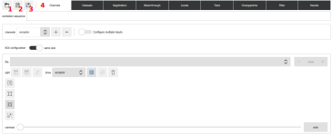
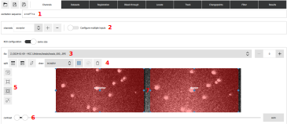
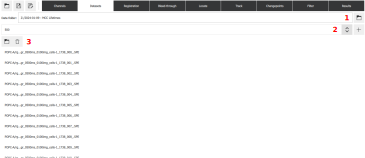
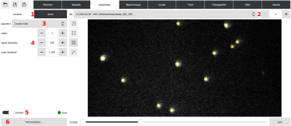
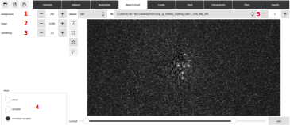
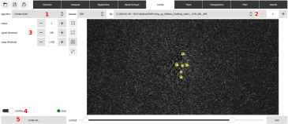
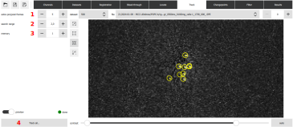
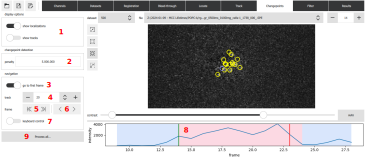
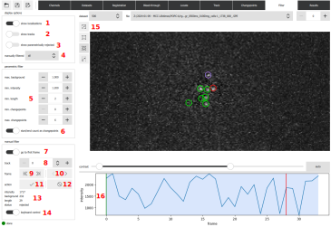
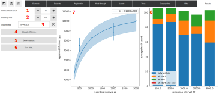

<!--
SPDX-FileCopyrightText: 2024 Lukas Schrangl <lukas.schrangl@boku.ac.at>

SPDX-License-Identifier: CC-BY-SA-4.0
-->

# Quantification of receptor–ligand interaction times via single-molecule FRET

This repository contains a GUI application for tracking single-molecule FRET signals arising from receptor–ligand iteractions (see [Huppa et al. 2010](https://doi.org/10.1038/nature08746) for the principle) and evaluating resulting tracking data using survival analysis.

## Installation

Run

```pip install numba smfret-bondtime```

*numba* is optional, but increases the speed of certain algorithms.
However, on some Linux setups, *numba* has lead to crashes of the software.
If this is the case for you, try without *numba*.

## Starting the GUI

Execute `smfret-bondtime` or `python -m smfret_bondtime`.
This will open a window as shown below.



The top bar contains the following buttons:

1. Load previously analyzed data.
    Data consists of a `.yaml` file and a `.h5` files which are otherwise named identically.
2. Save data.
3. Save data under a different name.
4. Buttons to select analysis step.
    These steps are described in the following sections.

## Definition of excitation and emission channels



1. Enter the excitation sequence. `d` for donor excitation, all other letters may specify different excitation types but are not used in analysis.
    In the screenshot, we have one acceptor excitation, followed by a variable number of repeated empty (`e`) and donor excitation (`d`) frames.
    The last frame of the sequence is again acceptor excitation.
    Due to the mark `?`, `ed` is repeated as many times as the number of frames in the microscopy videos allow.
    Note that the given sequence is repeated as needed.
    E.g., if only donor excitation frames are present in the video files, it is sufficient to specify `d` as the excitation sequence.
2. If donor and acceptor emission were recorded to separate files, enable this option to configure.
3. If donor and acceptor emission were recorded side by side in the same files, either use the `+` button in the dropdown menu to add an example file or drag and drop it from the file manager.
4. The image can be split horizontally or vertically with the leftmost buttons.
    Channels can be swapped with the third button or drawn by selecting the channel from the dropdown menu, pressing the button next to it, and drawing on the loaded image below.
5. These buttons permit zooming the image
6. Black and white point of the image can be set for better visibility of channel boundaries.
7. Channels can be adjusted by dragging the handles.

## Definition of datasets



1. Select the data folder.
    This should contain all of the data (fiducial markers for image registration if desired, microscopy videos for all recording intervals).
2. Click the `+` button to add a dataset.
    Enter the recording interval.
3. Add files either via a selection dialog (press the leftmost button) or by dragging and dropping from a file manager.

Repeat steps 2 and 3 for all recording intervals.
If bleed-through correction is to be performed, add fiducial markers to the predefined `registration` dataset.

## Image registration (optional)

This is a prerequisite for optional bleed-through correction.
If not desired, kip this step.



1. Selection of emission channel.
    Localization options need to be set for both channels individually.
2. File and frame selection allow for browsing through frames to check whether selected options are appropriate.
3. Algorithm selection.
    We recommend Crocker-Grier.
4. Options for the localization algorithm.
    Adjust as needed.
5. Toggle display of localization results on and off.
6. Once localization algorithm and options have been set both for donor and acceptor channels, press this button to perform image registration.
    The result will be shown once the calculation is finished.

## Bleed-through correction (optional)

This is not required, but can improve localization of single-molecule FRET signals.



1. Set camera baseline/background.
    Set bleed-through factor.
2. Donor emission intensity times this factor is subtracted from the acceptor emission image.
3. Sigma of Gaussian filter for smoothing the donor emission image before subtraction.
4. Choose which emission image to display.
5. Dataset, file and frame selection allow for browsing through frames to check whether selected options are appropriate.

## Single-molecule localization



1. Algorithm selection.
    We recommend Crocker-Grier.
2. Dataset, file and frame selection allow for browsing through frames to check whether selected options are appropriate.
3. Options for the localization algorithm.
    Adjust as needed.
4. Toggle display of localization results on and off.
6. Once localization algorithm and options have been set, press this button to perform single-molecule localization in all donor excitation frames of all datasets.
    This can take a while.
    Progress is indicated in a pop-up dialog.

## Single-molecule tracking



1. Extend and analyze each single-molecule track by this number of frames.
    This is necessary if changepoint detection is desired.
2. Maximum number of pixels a signal can move from one frame to the next and still be tracked.
3. Number of consecutive frames a signal may be missing and still be tracked.
4. Once tracking options have been set, press this button to perform single-molecule tracking in all datasets.
    This can take a while.
    Progress is indicated in a pop-up dialog.


## Changepoint detection (optional)

Changepoint detection can be used to define additional filter criteria for the next step, but is not used for lifetime determination.



1. Whether to lay localization markers and/or tracks over the image on the right.
2. The higher the penalty, the fewer changepoints are detected.
    First, find the right order of magnitude by adding or removing trailing zeros, then fine-tune.
3. If enabled, go to the track's first after choosing with the control (4) below.
4. Choose single-molecule track.
    The selected track is marked in purple on the image and its intensity time trace is displayed below.
5. Display the current track's first or last frame.
6. Display the previous or next frame.
7. If enabled, use left/right keys to go to previous/next frame, up/down keys to go to first/last frame, and page down/page up keys to go to previous/next track.
8. Intensity time trace of current track.
    First frame in which the signal was detected is indicated by the green vertical line, last frame by the red line.
    Changepoints are found wherever the background changes color (from blue to pink or pink to blue).
9. Once an appropriate penalty has been selected, use this button to perform changepoint detection for all tracks.

## Filtering



1. Whether to show localization markers in the image to the right (15).
2. Whether to show track markers in the image to the right (15).
3. Whether to show tracks reject by one of the parametric filters (5, 6).
4. Select which tracks are shown according to their manual filter status.
5. Set parametric filters.
    Tracks for which the mean background value is above `max. background`, for which the mean intensity is below `min. intensity`, whose length is less than `min. length` and which have fewer changepoints than `min. changepoints` or more than `max. changepoints` are rejected.
6. If selected, the fact that a track is present at the start and/or end of the observation window also counts as a changepoint.
    This compensates for the fact that the actual changepoint happened outside the observation window.
7. If enabled, go to the track's first after choosing with the control (8) below.
8. Choose single-molecule track.
    The selected track is marked in purple on the image and its intensity time trace is displayed below.
9. Display the current track's first or last frame.
10. Display the previous or next frame.
11. Mark the current track as accepted.
12. Mark the current track as rejected.
13. Some average quantities of the current track.
14. If enabled, use left/right keys to go to previous/next frame, up/down keys to go to first/last frame, page down/page up keys to go to previous/next track, the enter key to accept, and delete/backspace to reject the current track.
15. Current frame with localization markers indicating accepted (green), rejected (red), undecided (yellow), and the current track (purple).
16. Intensity time trace of current track.
    First frame in which the signal was detected is indicated by the green vertical line, last frame by the red line.
    Changepoints are found wherever the background changes color (from blue to pink or pink to blue).

## Calculation of results



1. Recording intervals with fewer tracks than this are excluded from analysis
2. How many runs of bootstrapping to perform.
    If set to 1, errors are calculated from covariances returned by fit routines instead.
3. Seed for the pseudo random number generator to allow for reproducible results with bootstrapping.
    A new seed can be randomly generated by pushing the button to the right.
4. Calculate lifetime and draw plots to the right.
    Note that only tracks that have not been rejected by a parametric filter and have been manually accepted are fed into the lifetime analysis.
5. Export numerical results to an Excel or Open Document spreadsheet.
    For the former, the `openpyxl` Python package needs to be installed, for the latter `odfpy`.
6. Save the plot to disk.
7. Plot of fit results.
8. Plot of track counts, indicating whether the are fully within the observation window, present already at the start of the window, still present at the end, or both.
